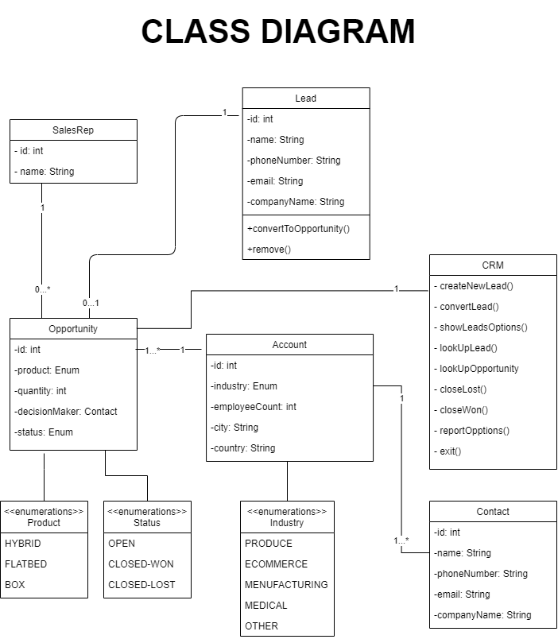
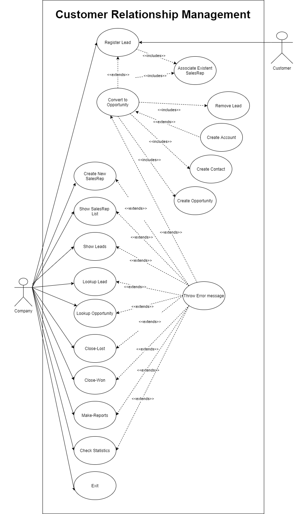

# Patatus-Project2-CRM

# CRM SYSTEM

## INSTALLATION

1. Clone the repo in your own computer, or download a zip with the project.
2. Fill /src/main/resources/application.properties with your data (database, user and password).
3. A .sql file is provided if you need to create the tables requiered by the CRM in your system.

## FEATURES

1. Console styled interface.
2. Ability to show a command list typidng <code>help</code> **(additional feature)**.
3. Ability to show a list of all Accounts **(additional feature)**.
4. Ability to run script files which includes fast creation of SalesReps, Leads, Opportunities, Contacts and Accounts for testing **(additional feature)**.

## USAGE

1. Run <code>Main.java</code> file in your favourite IDE.
2. Type your commands in the console (case insensitive. You can show a command list wit <code>help</code> command.).
3. First you need to create Sales Reps with <code>New SalesRep</code> command.
4. You can show a list of Sales Reps with <code>Show SalesRep</code> command.
5. Once you have Sales Reps in your DB, you can create leads with <code>New Lead</code> command.
6. It is possible to lookup for individual leads or list them all.
7. You can convert leads into opportunities with <code>convert</code> command.
8. Once converted, CRM will prompt you to choose if insert it into a new Account or into an existing one (if there is at least one existing account).
9. You can list accounts (with its contacts and opportunities) with <code>Show Accounts</code> command.
10. You can close-won or close-lost opportunities.
11. There is a brand-new Reporting Functionality feature with a ton of exciting options.
12. If you wonder how to exit, simply type exit. Fancy stuff.

## LIST OF AVAILABLE COMMANDS
|Command|Action|
|-------|------|
|new salesrep|Creates and registers a new SalesRep in the system.|
|show salesrep|Shows a list of the current SalesRep registered.|
|new lead|Creates and registers a new Lead in the system.|
|show leads|Shows a list of the current Leads registered.|
|lookup lead <id>|Looks for a Lead with corresponding <id> and shows its info.|
|convert <id>|Converts a Lead with corresponding <id> into a new Opportunity,prompting the user for the values needed during the conversion.|
|show accounts|Shows a list of the current Accounts registered **(additional feature)**.|
|close-won <id>|Closes an Opportunity with the corresponding <id>, with a sale made.|
|close-lost <id>|Closes an Opportunity with the corresponding <id>, with no sale made.|
|run <filename>|Runs the script file <filename> with an input on each line **(additional feature)**.|
|help|Shows this help screen.|
|exit|Exits the CRM console.|

## REPORTING FUNCTIONALITY
|Command|Action|
|-------|------|
|report lead by salesrep|Displays a count of Leads by SalesRep.|
|report opportunity by salesrep|Displays a count of all Opportunities by SalesRep.|
|report closed-won by salesrep|Displays a count of all CLOSED-WON Opportunities by SalesRep.|
|report closed-lost by salesrep|Displays a count of all CLOSED-LOST Opportunities by SalesRep.|
|report open by salesrep|Displays a count of all OPEN Opportunities by SalesRep.|
|report opportunity by country|Displays a count of all Opportunities by Country.|
|report closed-won by country|Displays a count of all CLOSED-WON Opportunities by Country.|
|report closed-lost by country|Displays a count of all CLOSED-LOST Opportunities by Country.|
|report open by country|Displays a count of all OPEN Opportunities by Country.|
|report opportunity by city|Displays a count of all Opportunities by City.|
|report closed-won by city|Displays a count of all CLOSED-WON Opportunities by City.|
|report closed-lost by city|Displays a count of all CLOSED-LOST Opportunities by City.|
|report open by city|Displays a count of all OPEN Opportunities by City.|
|report opportunity by industry|Displays a count of all Opportunities by Industry.|
|report closed-won by industry|Displays a count of all CLOSED-WON Opportunities by Industry.|
|report closed-lost by industry|Displays a count of all CLOSED-LOST Opportunities by Industry.|
|report open by industry|Displays a count of all OPEN Opportunities by Industry.|
|mean employeecount|Displays the mean employeeCount.|
|median employeecount|Displays the median employeeCount.|
|max employeecount|Displays the max employeeCount.|
|min employeecount|Displays the min employeeCount.|
|mean quantity|Displays the mean Quantity of products order.|
|median quantity|Displays the median Quantity of products order.|
|max quantity|Displays the max Quantity of products order.|
|min quantity|Displays the min Quantity of products order.|
|mean opps per account|Displays the mean number of Opportunities associated with an Account.|
|median opps per account|Displays the median number of Opportunities associated with an Account.|
|max opps per account|Displays the max number of Opportunities associated with an Account.|
|min opps per account|Displays the min number of Opportunities associated with an Account.|

## UML DIAGRAMS

### CLASS DIAGRAM

### USE-CAUSE DIAGRAM

### Patatús team
Alejandro Martínez, Ángel Serrano, Paúl Barroso, Coby Sardinero, Rubén Navarro. 
